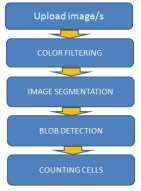
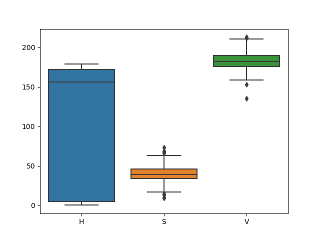
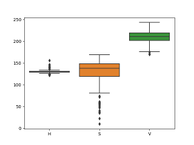
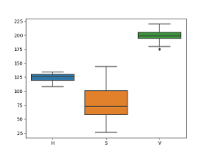
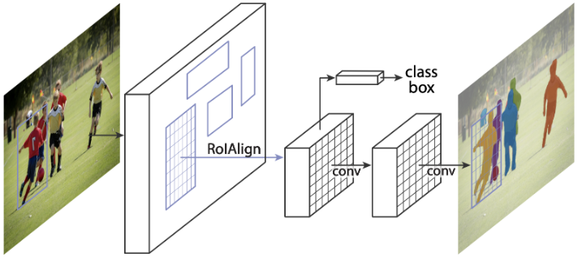
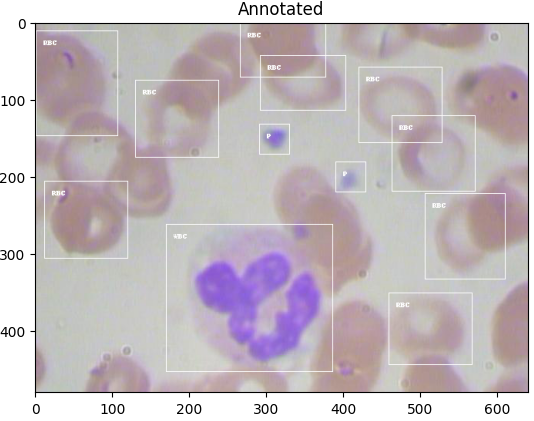
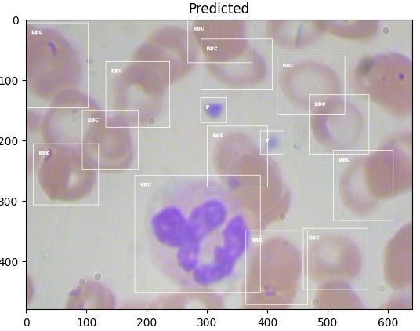

# blood-image-exp
BCCD dataset https://github.com/Shenggan/BCCD_Dataset

### IEEE paper on blood cell counting
https://ieeexplore.ieee.org/document/8652384

The primary objective is to present a more accurate counting of blood cells using the Python OpenCV programming language. It covers image processing and analysis of platelets, red blood cells, and white blood cells. This study presented an accurate counting of the specified types of cells. The algorithm used in this implementation consists of five (5) steps: Image Uploading, Color Filtering, Image Segmentation, Blob Detection, and Cell Counting.

### Image Uploading

BCCD dataset https://github.com/Shenggan/BCCD_Dataset were uploaded in the Python-based program processed and analyzed. In order for a Python program to process the image, the OpenCV library is imported.

### Color Filtering

Color determination was done to distinctively characterize the WBC, RBC, and Platelet cells from each other. Images were converted from BGR to HSV. Then upper and lower bounds as the range of color values were identified and later used for segmentation.

The HSV values of RBC, WBC, and Platelets were marked on several images using color_click.py and plotted using seaborn. Thresholds were determined from these values using "max" and "min".

#### HSV for RBC, WBC, and Platelets 

<table>
  <tr> <td align="center"> RBC </td> <td align="center"> WBC </td> <td align="center"> Platelets </td> </tr>
  <tr> <td> </td> <td></td> <td></td> </tr>
</table>

### Image Segmentation
 
Images were segmented using Otsu’s binarization technique. Only a grayscale version of the color-filtered images was used.

### Blob Detection

OpenCV SimpleBlobDetector was used to detect individual cells as blobs. Currently, only the area of cells is used as a criterion to identify the blobs. Since the WBC and platelets have similar color thresholds, the identified WBC are cut out before applying blob detection for platelets.

### Cell Counting

Finally, the number of key points detected with each of the thresholds corresponding to the different cell types is returned as the number of cells.

The original paper splits blood images into 10 segments before applying the algorithm. This has not been done in this code base.

# Image processing with Machine Learning Model

### Reference: https://pytorch.org/tutorials/intermediate/torchvision_tutorial.html 

#### Defining the Dataset

For this experiment, we use the torch 1.11 model. Here we are finetuning a pre-trained Mask R-CNN model using the BCCD data set. Clone the BCCD data set and use the new features in order to train an instance segmentation model on a custom dataset. Here PIL library is imported. 
PIL library is used for image processing in the pre-trained model. 

In the current problem, there are 4 classes due to the cell types. We label the classes as "RBC = 1", "WBC = 2", "Platelets = 3", and "Background = 0". The Mask R-CNN model requires boxes, labels, areas, and masks to identify the segments. Using x min, y min, x max, and y max, the boxes and areas are created for each annotated segment. The labels are also stored using the classes. For the masks, each annotated box is encoded as a different number. 

During the training (finetuning using BCCD dataset), image transformation of flip is used via the get Transform function. This improves the prediction quality. A custom-dataset function has been implemented using BCCD Dataset for training purposes.  

#### Draw the image 

Pil_smear is used to draw boxes with a label (either from annotations or predictions) around the cell types. In the predictions, the boxes are drawn only if the prediction score is > 0.5. 

#### Fine-tuning process

Following are the steps employed for finetuning

1. Implemented custom dataset function
2. Move the model to GPU if available. 
3. Split the available data into training and test items.
4. Load pre-trained Mask R-CNN model.
5. Train for N (e.g., 10) epochs using the custom dataset. Store training and validation losses
6. Save the finetuned model.

 
*Mask R CNN*

#### Inference using GPU / CPU

Following are the steps employed for inference.

1. Get the torch model.
2. Load the finetuned model (pretrained_1570)
3. Move the model to GPU if available.
4. Predict the cell types using the model. 

#### Note 

Prediction done using this pre-trained model and machine learning is more accurate when compared to the image processing done using blob detection and counting.

# Run the notebook in Colab
https://colab.research.google.com/github/shreeja-shreeja/blood-image-exp/blob/main/blood_segment.ipynb

https://colab.research.google.com/github/shreeja-shreeja/blood-image-exp/blob/main/blood_cell_count.ipynb
