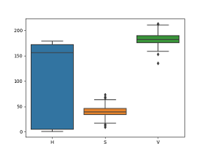

# blood-image-exp
BCCD dataset https://github.com/Shenggan/BCCD_Dataset

### IEEE paper on blood cell counting
https://ieeexplore.ieee.org/document/8652384

The primary objective is to present a more accurate counting of blood cells using the Python OpenCV programming language. It covers image processing and analysis of platelets, red blood cells, and white blood cells. This study presented an accurate counting of the specified types of cells. The algorithm used in this implementation consists of five (5) steps: Image Uploading, Color Filtering, Image Segmentation, Blob Detection, and Cell Counting.

### Image Uploading

BCCD dataset https://github.com/Shenggan/BCCD_Dataset were uploaded in the Python-based program processed and analyzed. In order for a Python program to process the image, the OpenCV library is imported.

### Color Filtering

Color determination was done to distinctively characterize the WBC, RBC, and Platelet cells from each other. Images were converted from BGR to HSV. Then upper and lower bounds as the range of color values were identified and later used for segmentation.

The HSV values of RBC, WBC, and Platelets were marked on several images using color_click.py and plotted using seaborn. Thresholds were determined from these values using "max" and "min".

#### HSV for RBC, WBC, and Platelets 

<table>
  <tr> <td align="center"> RBC </td> <td align="center"> WBC </td> <td align="center"> Platelets </td> </tr>
  <tr> <td> </td> <td></td> <td></td> </tr>
</table>

### Image Segmentation
 
Images were segmented using Otsu’s binarization technique. Only a grayscale version of the color-filtered images was used.

### Blob Detection

OpenCV SimpleBlobDetector was used to detect individual cells as blobs. Currently, only the area of cells is used as a criterion to identify the blobs. Since the WBC and platelets have similar color thresholds, the identified WBC are cut out before applying blob detection for platelets.

### Cell Counting

Finally, the number of key points detected with each of the thresholds corresponding to the different cell types is returned as the number of cells.

The original paper splits blood images into 10 segments before applying the algorithm. This has not been done in this code base.

# Image processing with Machine Learning Model

### Reference: https://pytorch.org/tutorials/intermediate/torchvision_tutorial.html 

#### Defining the Dataset

For this experiment, we use torch 1.11 model. Here we are finetuning a pre-trained Mask R-CNN model into the BCCD data set. Clone the BCCD data set and use the new features in torch-vision in order to train an instance segmentation model on a custom dataset. Here IPL library is imported. This converts the Image and annotations to a desired model that is required for this pretrained model. 

Open the Image, initially it creats a black image. Here the cell types have 4 classes. Label the cell types as "RBC = 1", "WBC = 2", "Platelets = 3", and "Background = 0". Using x min, y min, x max, and y max mark the annotations with the labels. Once the boxes and labels are marked, if the cell types are encoded as different colors, then mask the number of boxes. Then calculate the area of each boxes and transform it in the pre-trained model. Inference these results. Then extract annotations for one image. To improve the quality of the prediction get transform for training purpose. 

#### Draw the image "Writing a custom dataset"

Pil_smear is used to draw boxes to the cell types. Plot annotations only if the score > 0.5. Get the pre-trained model, get torch (No of classes = 4). Load the BCCD data set and fine-tune it. 

#### Inference using GPU / CPU

Get the torch model, retrain 1570 BCCD data. For model evaluation, give the image to the model and predict the image. 

#### Note 

Prediction done using this pre-trained model and machine learning is more accurate when compared to the image processing done using blob detection and counting.

# Run the notebook in Colab
https://colab.research.google.com/github/shreeja-shreeja/blood-image-exp/blob/main/blood_segment.ipynb

https://colab.research.google.com/github/shreeja-shreeja/blood-image-exp/blob/main/blood_cell_count.ipynb
